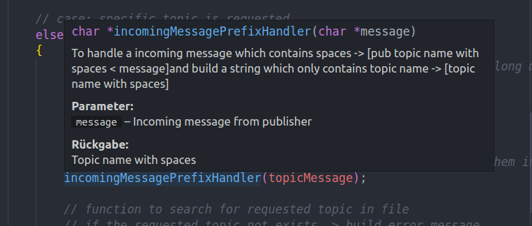

# Prüfungsaufgabe - Message Broker

## Prüfungsaufgabe

Enwicklung eines einfachen Message Brokers **smbbroker** und den dazugehörigen
Dienstprogrammen **smbpublish** (Publisher) und **smbsubscribe** (Subscriber).

Nachrichten bestehen aus einem Tupel **topic** und **message**, beide sind als Strings zu implementieren.

Besondere Nachricht (Topic): 

<u>Wildcard:</u>

**#** - hier alle Topics beim Broker an Subscriber weiterleiten

Broker soll Nachrichten vom Publisher empfangen und an Subscriber weiterleiten.
Dazu muss der Broker ständig laufen und auf eingehende Nachrichten von Publisher
oder Subscriber hören.

## Umsetzung

**Subscriber:**

- Kann ein Topic vom Broker anfragen und bekommt eine oder mehrere Antworten
  - Topic kann mehrere Wörter enthalten
  - Bleibt nach erfolgreicher Eingabe auf Abruf um Updates entgegen zu nehmen

<br>

- Eingaben um Subscriber erfolgreich zu benutzen :
  
- Direkt als Kommando :

```
./sub hostname topic
```
- Start im Client-Modus um bei Eingabe zu helfen :

```
./sub hostname
```
- Wildcard bietet Möglichkeit jedes Topic abzurufen :

```
./sub hostname "#"
```

<br>

**Publisher:**
- Kann dem Broker unter einem bestimmten Topic eine Message übermitteln
  - Topic sowie Message können mehrere Wörter enthalten

<br>

- Eingaben um Publisher erfolgreich zu benutzen :
  - Direkt als Kommando

```
./pub hostname topic "<" message
```
- Start im Client-Modus um mehrere Anfragen zu bearbeiten

```
./pub hostname
```

<br>

**Client(optional):**
- Kombiniert die Funktionen von Subscriber und Publisher
  - Subscriber kann nur den aktuellen Stand fetchen
  - Kann beliebig oft mit Broker interagieren
  
<br>

- Eingaben um Client erfolgreich zu benutzen :
```
./cli hostname
```

<br>

**Broker:**

- verwaltet die Topics und Messages und in der Topic-File: `Topic.txt`
  - damit ist der Broker *statisch*
  
- Broker bekommt Nachrichten von Publisher und Subscriber
  - Publisher-Message-Struktur: `PUB TOPIC < MESSAGE`
  - Subscriber-Message-Struktur: `SUB TOPIC` 

- Nachrichten sind durch den Präfix mit `PUB` und `SUB` eindeutig zuzuordnen

<br>

<u>Struktur der Datei - Topic und Message:</u>
> Filename: Topic.txt

    [Topic] [Message]
    [Topic] [Message]
    [Topic] [Message]
    ...

- strukturell ist es nach einem `[Schlüssel : Wert]` Prinzip angeordnet
- damit ist es möglich gezielt nach einem jeweiligen Topic zu suchen und beim Auffinden die dazugehörige Message zu entnehmen


<u>Besonderheit vom Broker:</u>

Topics werden im File aktuallisiert, d.h. wenn Publisher eine Topic beim 
Broker veröffentlicht, die bereits im File eingetragen ist, wird der alte
Eintrag mit dem Neuen ersetzt. 

<br>

* * *
## Library

Bei der Umsetzung der Aufgabe und den dazugehörigen Anforderungen, wurde eine Funktionsbibliothek für den Message Broker sowie die Dienstprogramme
geschrieben.

Damit wird nicht nur gewährleistet, dass der jeweilige Programmcode von Broker, Subscriber, Publisher nicht nur lesbarer sind, es werden darüber hinaus  Wiederholungen von Codesequenzen vermieden und die Wiederverwendbarkeit ermöglich.

**Library-Files:**

`LibMB.h`: *(Library Message Broker)*
- Header-File, Übersicht zu den enthaltenen Methoden und Konstanten

`LibSrc.c`: *(Library Source)*
- Implementierung der im Header-File enthaltenen Methoden

**Dokumentation:**

Die Dokumentation von den Bibliotheksfunktionen erfolgte im [Javadoc](https://de.wikipedia.org/wiki/Javadoc) Stil und gibt neben einer kurzen Beschreibung
der Aufgabe die Parameter, die Rückgabe und die Exception der jeweiligen Funktion an.

**Empfehlung:**

Für die interaktive Nutzung der Dokumentation empfehlen wir den Einsatz einer
IDE, die Kommentare beim Hovern über der jeweilgen Funktion anzeigt.

Bsp.:
<figure>
  
  <figcaption>
    <b>Abb.</b> Hoverfunktion Dokumentation in Visual Studio Code
    </figcaption>
</figure>
<br>
<br>

* * *

## Ausführungshinweis vom Programm

Terminal-Befehle:

> Object File von Lib-Implementierung:

```
gcc LibSrc.c -c
```

> Kompilierung Broker:

```
gcc -o bro smbBroker.c LibSrc.o -lm -fopenmp
```

> Kompilierung Subscriber:

```
gcc -o sub smbSubscriber.c LibSrc.o -lm -fopenmp
```

> Kompilierung Publisher:

```
gcc -o pub smbPublisher.c LibSrc.o -lm -fopenmp
```

> Kompilierung Client (Publisher/ Subscriber):

```
gcc -o cli smbClient.c LibSrc.o -lm -fopenmp
```
